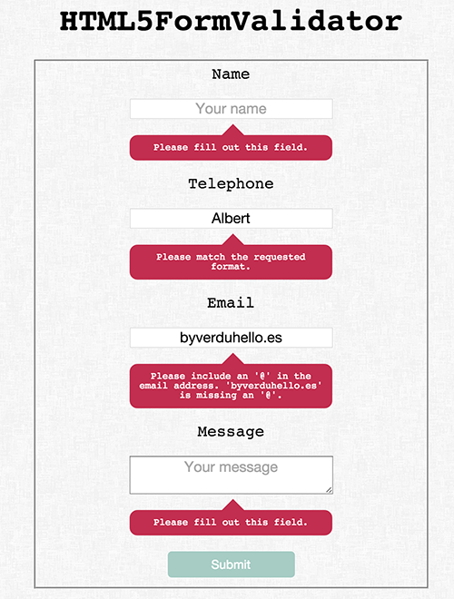

# HMTL5 Form Validator

A simple and customizable form validator. There is by default some predefined CSS styles for the error messages that each browser shows if a form is submitted and some fields are empty or with a wrong value.

The idea is to change the CSS styles of this messages so they will look the same in each browser. 

In the html file you will find a really simple example, the `required` attribute is a must. Take a look to all the possible values for the `type` attribute used in the `input` tag.

There is a version for plain javascript and another one for jQuery.

Demo

  

## ToDo

There is a lot to improve:

1. Adding a node server with nodemailer to receive custom message after a success submit.
2. Adding more ways to display the error messages.
3. Improve the code.
4. ...